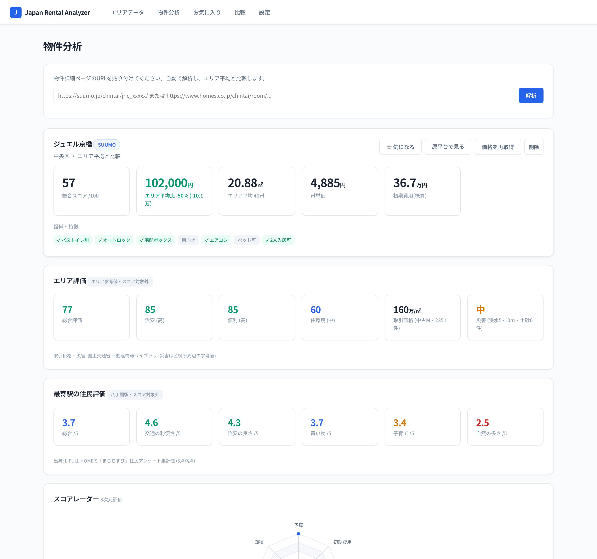
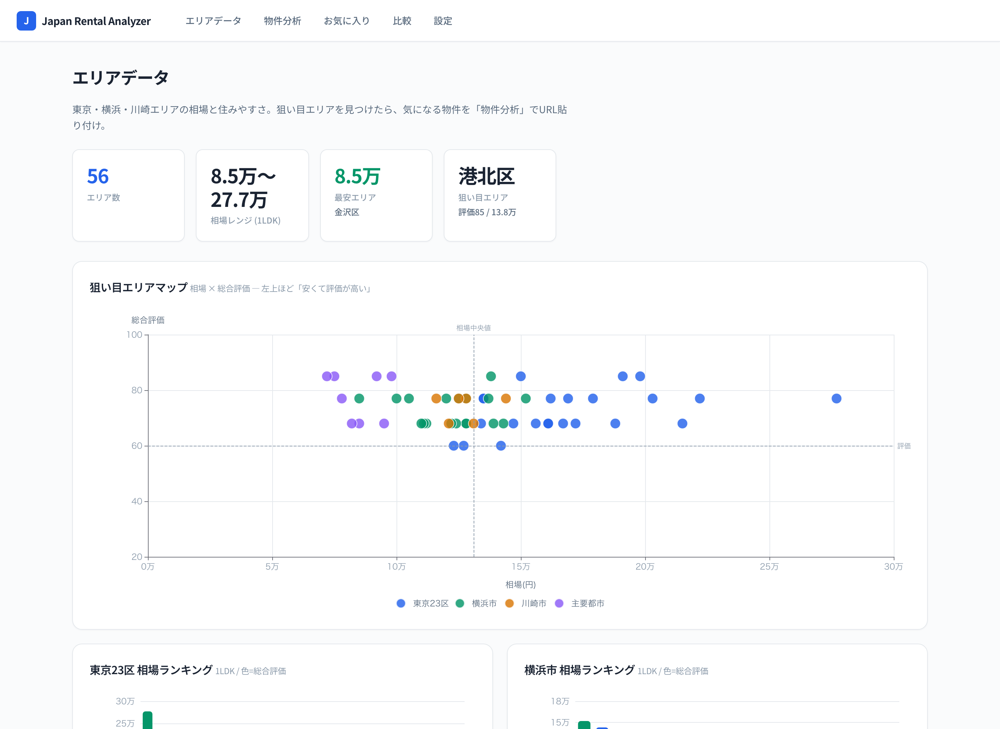
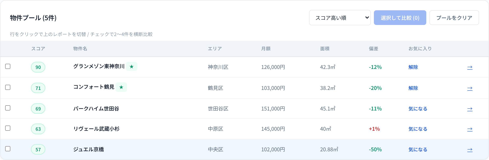
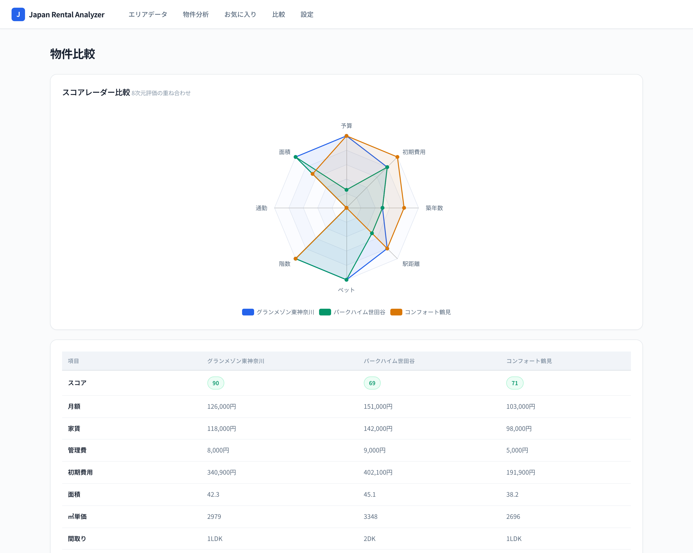

# Japan Rental Analyzer

気になる賃貸物件の URL を貼り付けるだけで、物件解析・個人条件スコアリング・エリア相場比較・公的オープンデータ(取引価格/災害リスク)・駅の住民評価までを 1 枚のレポートにまとめる、意思決定支援ツール。

物件詳細・問い合わせ・申込は各掲載元サイトで行う設計(本ツールは分析に特化)。

## スクリーンショット

**物件分析レポート** — URL を貼るだけで、スコア・エリア偏差・公的データ・駅の住民評価まで 1 枚に:



**エリアデータ** — 狙い目エリアマップ (相場 × 総合評価) と相場ランキング:



**物件プール / 比較**:

| 物件プール | 8次元レーダー比較 |
|---|---|
|  |  |

## できること

**1. 単件分析 — URL を貼るだけ**
- SUUMO / LIFULL HOME'S / athome / Yahoo!不動産 の物件詳細ページを自動解析
  (賃料・管理費・敷金礼金・面積・間取り・階数・築年数・駅徒歩・設備)
- 個人条件による **8次元スコア** (予算/面積/通勤/階数/ペット/駅距離/築年数/初期費用, 重み付き正規化 0-100)
- **エリア相場との偏差** (±何円・何%か一目で分かる)
- **初期費用の内訳ドーナツ** (敷金/礼金/仲介手数料/前家賃/諸費用の概算)
- **価格履歴** (再取得で価格変動を折れ線で追跡)

**2. 公的データ・住民評価 (表示専用・スコア対象外)**
- **取引価格**: 国土交通省 不動産情報ライブラリ API から関東48区の中古マンション
  ㎡単価中央値 + 取引件数 (直近4四半期)
- **災害リスク**: 洪水浸水想定(想定最大規模)の最大浸水深 + 土砂災害警戒区域数
  から 低/中/高 の目安を表示 (区役所周辺の参考値)
- **駅の住民評価**: LIFULL HOME'S「まちむすび」の住民アンケート集計値
  (交通/治安/買い物/子育て/自然, 5点満点) を最寄駅ごとに表示

**3. 物件プール — 貼るほど貯まる**
- 貼り付けた物件が自動でプールに蓄積 (行クリックでレポート切替)
- **コスパ散布図** (面積×月額+エリア平均線) / **間取り分布** / **特徴ワードクラウド** (家の形)
- チェックで 2〜4 件を選び **8次元レーダー重ね合わせ + 横断比較表**
- お気に入り + 検討ステータス管理 (気になる→内見→申込…の進捗ボード)

**4. エリアデータ (物件ゼロでも使える)**
- 狙い目エリアマップ (相場 × 総合評価の散布図)
- 東京23区/横浜の相場ランキング・エリア比較レーダー・全48区ソート可能テーブル

## データソースと出典

| データ | 出典 | 取得方法 |
|---|---|---|
| 物件情報 | ユーザーが貼った詳細ページのみ | 単発取得 (一括クロールなし) |
| エリア平均賃料 | SUUMO 家賃相場ページ | 低頻度・手動シード |
| 不動産取引価格 | 国土交通省 不動産情報ライブラリ (XIT001) | 公式 API (要 API キー) |
| 災害リスク | 同上 (XKT026 洪水 / XKT029 土砂) | 公式 API タイル |
| 駅の住民評価 | LIFULL HOME'S まちむすび | 集計スコアのみ・口コミ本文は保存しない |

## 技術スタック

| レイヤー | 技術 |
|---|---|
| バックエンド | Python 3.14 / Flask (単一アプリ) |
| データベース | SQLite (11テーブル: 物件/スコア/状態/価格履歴/エリア/公的データ/駅評価 ほか) |
| スクレイピング | requests / BeautifulSoup4 (robots.txt 遵守・礼儀スリープ) |
| 公的データ | 不動産情報ライブラリ API + XYZ タイル座標計算 |
| 駅名照合 | pykakasi (漢字→ローマ字) + 正規化 + 近似マッチ |
| 通勤計算 | NAVITIME Transfer API (オプション) |
| フロントエンド | Jinja2 / Vanilla JS / ECharts 5 / wordcloud2.js |
| テスト | pytest (74テスト) |

## セットアップ

```bash
# 1. 仮想環境 + 依存
python3 -m venv .venv
source .venv/bin/activate
pip install -r requirements.txt -r requirements-dev.txt

# 2. 環境変数 (任意)
cp .env.example .env
#   REINFOLIB_API_KEY : 不動産情報ライブラリ (取引価格/災害。無くても動作)
#   NAVITIME_CLIENT_KEY: 通勤時間 (無ければ通勤スコアは自動除外)

# 3. DB 初期化 + エリア相場シード
python scripts/init_db.py
python scripts/seed_regions.py

# 4. 公的データ (REINFOLIB_API_KEY がある場合)
python scripts/fetch_public_data.py      # 取引価格 + 災害 (四半期ごとに再実行)

# 5. 起動
python app.py    # http://127.0.0.1:5000
```

## 使い方

1. **物件分析** ページで気になる物件の URL を貼り付けて「解析」
2. レポートで スコア/偏差/初期費用/エリア評価/駅住民評価 を確認
3. 何件か貯まったらプールでソート・チェックして「選択して比較」
4. 気に入ったら ★ でお気に入り登録 → **お気に入り** ページで検討進捗を管理
5. 駅の住民評価は貼り付け時に自動取得。まとめて取り直す場合:
   `python scripts/fetch_station_reviews.py`

## テスト

```bash
.venv/bin/pytest tests/ -q
```

## Render デプロイ

1. New → Web Service → この GitHub リポジトリを接続
2. Build: `pip install -r requirements.txt` / Start: `gunicorn app:app --bind 0.0.0.0:$PORT --workers 1`
3. Persistent Disk 1GB, Mount Path `db`
4. 環境変数: `DB_PATH=/opt/render/project/src/db/database.db`, `REINFOLIB_API_KEY=...`
5. デプロイ後に Shell で一度:
   `python scripts/fetch_public_data.py && python scripts/fetch_station_reviews.py`

## コンプライアンス方針

- 解析するのはユーザーが明示的に貼った物件ページのみ。サイト横断クロールはしない
- 各取得の前に robots.txt を確認し、Disallow はスキップ。リクエスト間に礼儀スリープ
- CAPTCHA 等の bot 対策は迂回しない (bot 対策が確認されたソースは採用しない)
- 住民評価は集計数値のみ保存し、口コミ本文・個人情報は保存しない
- 公的データ・住民評価は出典を UI に明示し、物件スコアには算入しない (表示専用)
- 個人の学習・意思決定支援が目的。データの商用再配布はしない
