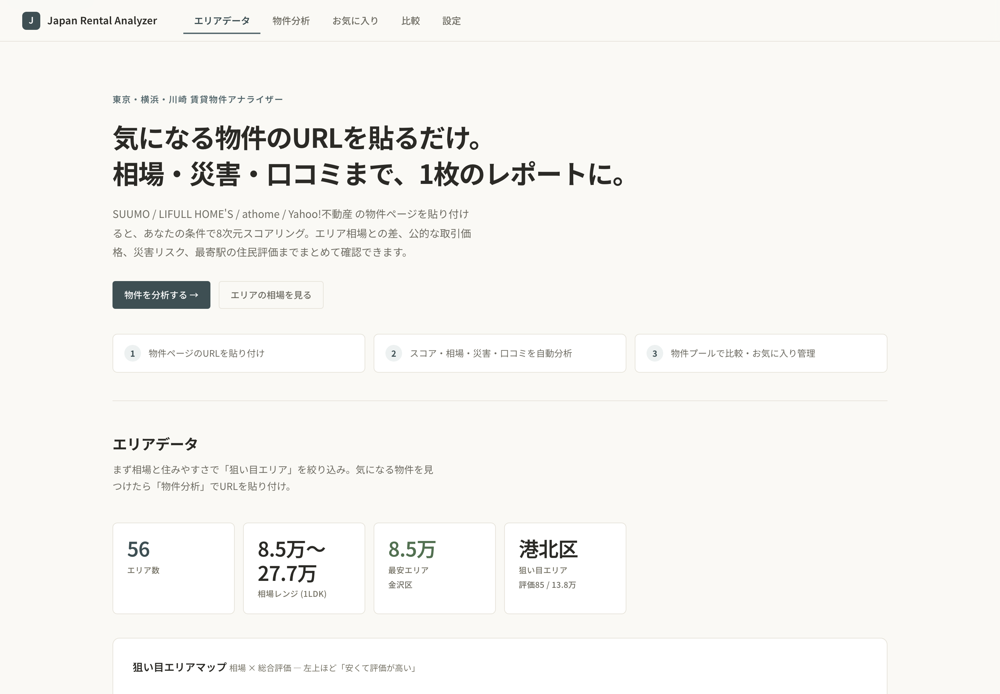
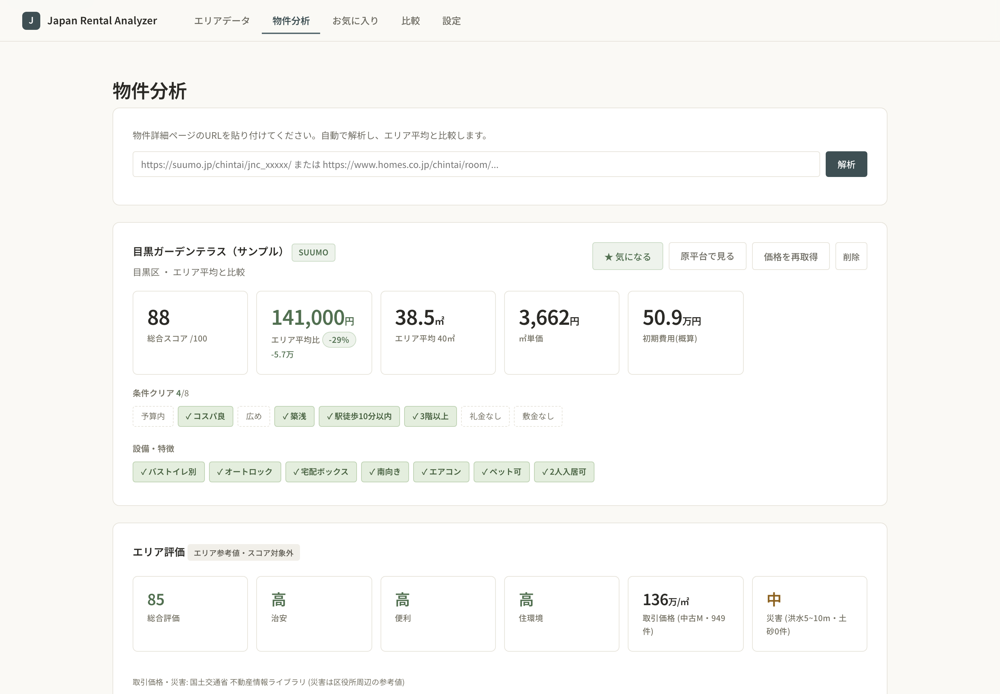
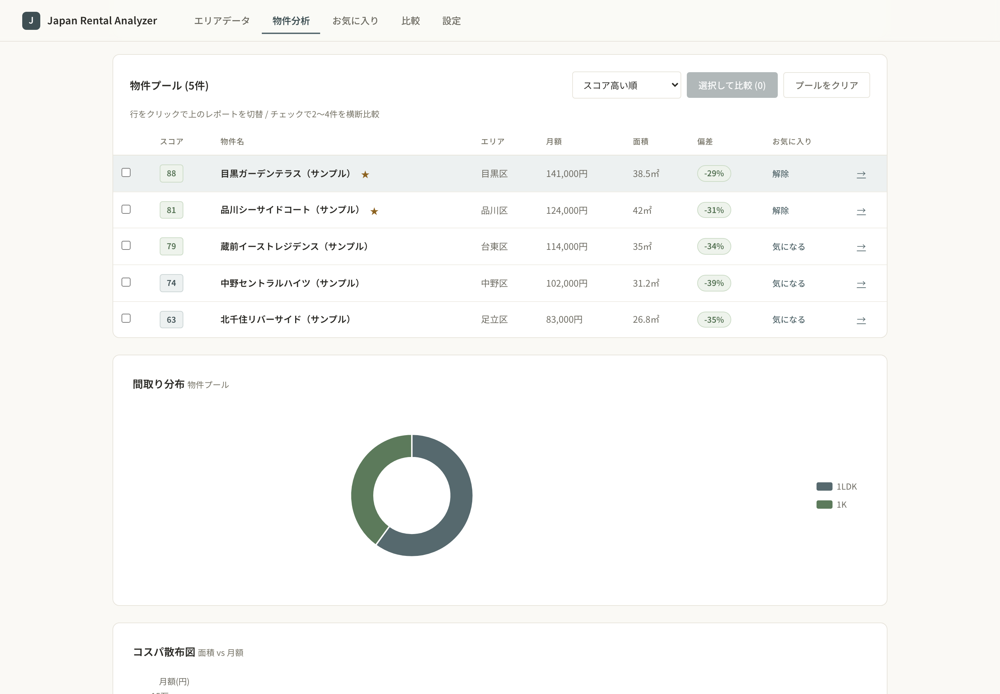
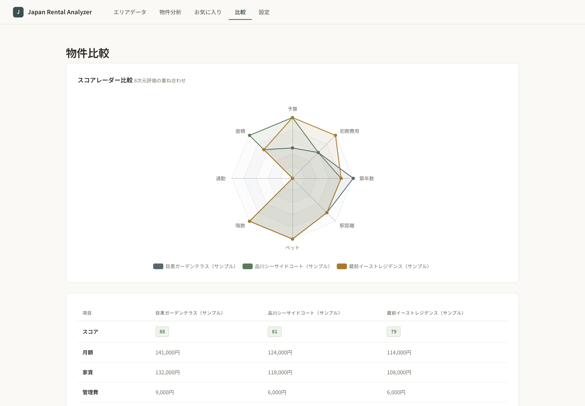
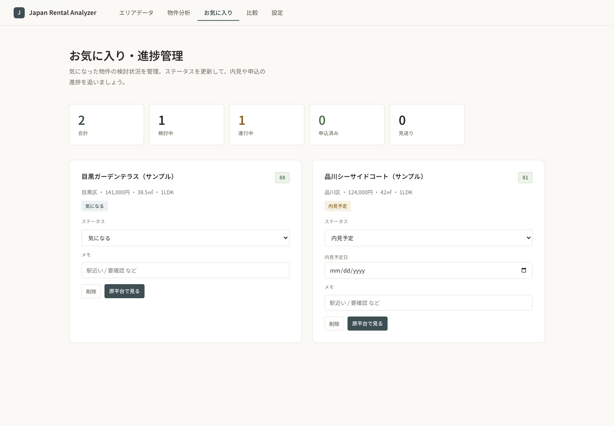
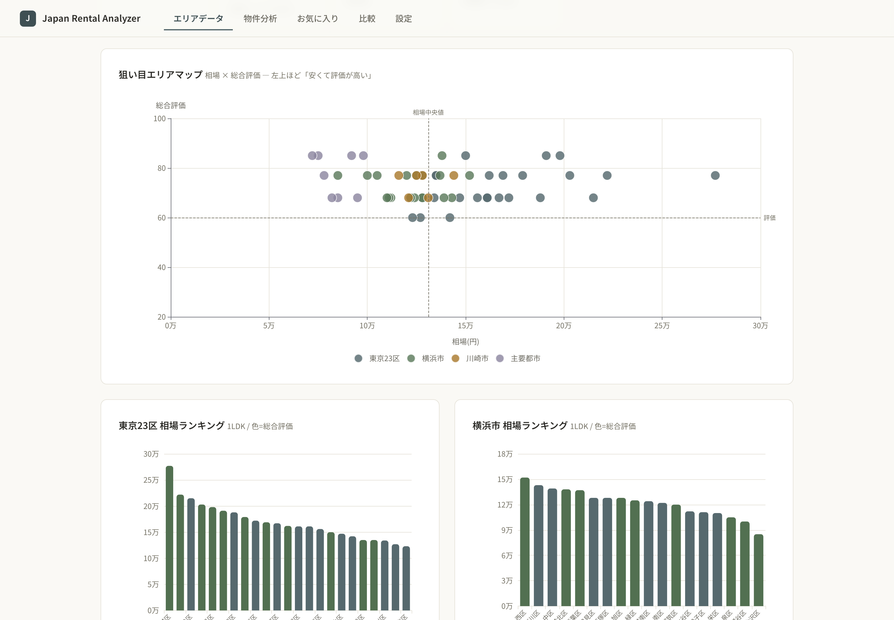

<div align="center">

# Japan Rental Analyzer

**粘贴房源链接，行情、灾害风险与居民评价汇成一页报告。**

东京 · 横滨 · 川崎 租房决策工具

### [▶ 打开在线演示](https://tokyo-yokohama-rental-intelligence.onrender.com)

[源码](https://github.com/panda-pig/Japan-Rental-Analyzer) · [English](README.md) · [日本語](README.ja.md) · **简体中文**

</div>



<sub>截图中的房源为示例数据；区域行情、成交价格与灾害风险为真实数据。<br>
演示部署在 Render 免费方案上，闲置一段时间后首次打开需要约一分钟唤醒。</sub>

---

在日本找房，往往要把同一套房子在四个网站各开一遍，然后靠感觉判断：这个租金合不
合理、那片区域会不会积水、那个车站周边住起来到底怎么样。这个工具用一条粘贴的
链接回答这三件事。

## 功能

### 1. 贴一个链接，出一页报告

支持 SUUMO / LIFULL HOME'S / athome / Yahoo!不動産 的房源详情页，自动解析租金、
管理费、押金、礼金、面积、户型、楼层、房龄、步行分钟数与设备。



- **8 维评分** —— 预算、面积、通勤、楼层、宠物、车站距离、房龄、初期费用，按你
  自己的权重加权并归一化到 0–100
- **与区域相场的偏差** —— 比行情高或低多少钱、百分之多少
- **初期费用构成** —— 押金、礼金、中介费、预付房租、杂费的环形概算
- **条件达成** —— 八项条件命中了哪几项，未达成的也灰显出来而不是隐藏
- **价格历史** —— 重新抓取后用折线记录价格变动

### 2. 公开数据与居民评价

与房源并列展示，但**刻意不计入评分**——它们描述的是区域，不是这套房子。

- **成交价格** —— 国土交通省不动产信息库提供的二手公寓每平米单价中位数与成交
  件数（关东 48 区、最近四个季度）
- **灾害风险** —— 洪水浸水想定的最大浸水深度，加上土砂灾害警戒区域数量，归纳为
  低 / 中 / 高
- **车站居民评价** —— LIFULL HOME'S「まちむすび」的居民问卷汇总分（交通、治安、
  购物、育儿、自然），按最近车站展示

### 3. 越贴越多的房源池



分析过的房源会留在池中。点击某一行即可切换上方报告，可按评分、月额、面积、每平
米单价或区域偏差排序。勾选 2–4 套即可横向比较。



比较页把 8 维雷达图叠加，并把所有字段并排成表。未能取得的数值会显示「未取得」，
而不是悄悄写成 0。

### 4. 收藏与进度管理



加星后可按 気になる → 内見 → 申込 的流程带备注跟进。

### 5. 一套房源都没有时也能用的区域数据



行情 × 综合评价的散点图（越靠左上越是「便宜且评价高」），东京 23 区与横滨市的
行情排行、两区对比雷达图，以及全部 56 个区域的可排序表格。

## 数据来源与出处

| 数据 | 来源 | 获取方式 |
|---|---|---|
| 房源信息 | 仅限用户粘贴的详情页 | 单次获取，不做批量爬取 |
| 区域平均租金 | [SUUMO 家賃相場](https://suumo.jp/chintai/soba/) | 低频、手动导入 |
| 不动产成交价 | [国土交通省 不动产信息库](https://www.reinfolib.mlit.go.jp/) (XIT001) | 官方 API（需密钥） |
| 灾害风险 | 同上 (XKT026 洪水 / XKT029 土砂) | 官方 API 瓦片 |
| 车站居民评价 | [LIFULL HOME'S まちむすび](https://www.homes.co.jp/machimusubi/) | 仅存汇总分，不存评论正文 |

## 技术栈

| 层 | 选型 |
|---|---|
| 后端 | Python 3.14 / Flask |
| 数据库 | SQLite，版本化数据库迁移 |
| 抓取 | requests / BeautifulSoup4，遵守 robots.txt，请求间礼貌休眠 |
| 公开数据 | 不动产信息库 API + XYZ 瓦片坐标计算 |
| 站名匹配 | pykakasi（汉字→罗马字）+ 归一化 + 近似匹配 |
| 通勤计算 | NAVITIME Transfer API（可选） |
| 前端 | Jinja2 / 原生 JS / ECharts 5 / wordcloud2.js |
| 测试 | pytest + Node.js 回归测试 |

抓取目标按解析出的主机名与白名单严格比对，拒绝私有地址，并对每一跳重定向重新
校验。抓来的文本进入 DOM 前一律转义。设置了 `ADMIN_TOKEN` 的环境中，写操作
与配置变更需要该令牌。

界面以 WCAG 2.1 AA 为目标：表格可用键盘操作、每张图表都有文字替代、表单结果有
live region 播报、对比度达 AA、触控目标 44px，并支持 `prefers-reduced-motion`。

## 安装

```bash
python3 -m venv .venv
source .venv/bin/activate
pip install -r requirements.txt -r requirements-dev.txt

cp .env.example .env
#   REINFOLIB_API_KEY   : 不动产信息库（可选）
#   NAVITIME_CLIENT_KEY : 通勤时间（没有则自动跳过通勤维度）
#   ADMIN_TOKEN         : 设置后所有写接口需要该令牌

python scripts/init_db.py
python scripts/seed_regions.py
python scripts/fetch_public_data.py   # 仅在有 REINFOLIB_API_KEY 时

python app.py    # http://127.0.0.1:5000
```

```bash
.venv/bin/pytest tests/ -q
```

批量抓取走命令行，没有对应的 HTTP 接口：
`python scripts/run_scrape.py` 读取 `source_configs` 表中的配置执行。
设置了 `ADMIN_TOKEN` 时，页面会在第一次写操作时询问一次令牌，
并记在浏览器里。

## 部署到 Render

1. New → Web Service → 关联本仓库
2. Build `pip install -r requirements.txt`，
   Start `gunicorn app:app --bind 0.0.0.0:$PORT --workers 1 --threads 4`
3. Persistent Disk 1GB，挂载路径 `db`
4. 环境变量 `DB_PATH=/opt/render/project/src/db/database.db`、
   `REINFOLIB_API_KEY`、`ADMIN_TOKEN`
5. 部署后在 Shell 里执行一次：
   `python scripts/fetch_public_data.py && python scripts/fetch_station_reviews.py`

## 合规方针

- 只解析用户明确粘贴的房源页面，不做跨站爬取
- 每次抓取前检查 robots.txt 并遵守 Disallow，请求之间礼貌休眠
- 不绕过 CAPTCHA 等反爬机制；确认有反爬机制的来源一律不采用
- 居民评价只保存汇总数值，不保存评论正文与个人信息
- 公开数据与居民评价在界面上标明出处，且不计入房源评分
- 仅用于个人学习与决策辅助，不对数据做商业再分发


[可靠性更新与升级说明](UPGRADE.md)
